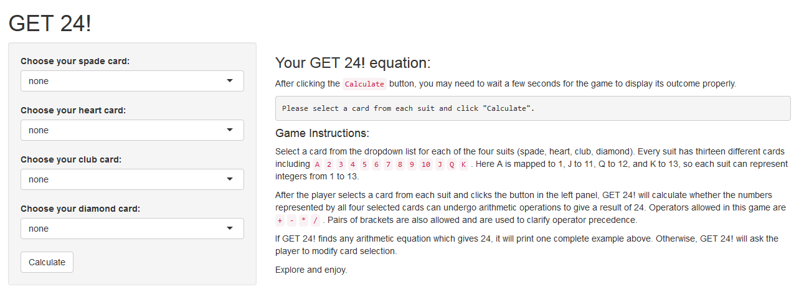

## Inspiration of GET 24! 

People have designed thousands of games based on Pokers. Ever since Poker cards were invented, the influence of these cards have never been faded. 

The idea of GET 24! originated from a popular game I like to play with friends. We use full suits of Poker cards to represent integers from 1 to 13. Each round, four cards are drawn randomly from the card deck. Then these cards and thus the integers they represnt are revealed to every player. Whoever first manages to construct an arithmetic expression equal to twenty-four using these integers (operands) and regular arithmetic operators is the winner of the current round. 

This is a fun and challenging game, especially when multiple players are trying to compete with each other. 

--- 

## Layout of GET 24! 

As you can see, below is a partial screenshot of GET 24!.



--- 

## Widgets of GET 24! 

The outcome of each round is displayed in the right (main) panel. Game instructions are placed below the main text output in the right panel. 

Player controls the widgets in the left (sidebar) panel. There are four dropdown lists in the left panel, each provides thirteen valid choices representing different cards in each card suit. Player gets to select one card from each dropdown list. Essentially, each card can be mapped to an integer between 1 to 13. 

To view the proper outcome, player not only needs to choose four cards but also needs to click the "Calculate" button at the bottom of the left panel. Once the button is clicked, it may take a couple of seconds for GET 24! to calculate and print the outcome at the top of the right panel. 

--- 

## Flow of GET 24!

I. Player chooses four integers in the range of 1 to 13. In GET 24!, A is mapped to 1, J to 11, Q to 12, K to 13. Integers can be repetitive.
II. GET 24! calculates all possible arithmetic expressions using these four integers and three operators from add(+), substract(-), multiply(*), and/or divide(/). (Operators can be repetitive.) A typical arithmetic expression: 
```{r sample2}
set.seed(2); a <- sample(13, 4, replace = TRUE)
set.seed(4); b <- sample(4, 3, replace = TRUE)
sign <- c("+", "-", "*", "/")
cat("(", "(", "(", a[1], sign[b[1]], a[2], ")", sign[b[2]], a[3], ")", sign[b[3]], a[4], ")")
```
III. The default order of operation as secured using pairs of brackets is from left to right. If GET 24! finds one or more expressions that equals 24, it will print the first of those expressions. Otherwise, it will modify the order of operations and continue searching until it runs out of possible expressions. 

---

## Ready to have a try? 

[GET 24!](https://pray4y.shinyapps.io/Get24_DevDataProd_CP/)

This page display a set of four integers randomly selected from 1 to 13. 
It will also give a valid GET 24! equation (if existing) corresponding to these four numbers. 

```{r get24, echo = FALSE}
get24 <- function(num) {
        sign <- c("+", "-", "*", "/")
        num <- num
        where24 <- 0    ## When solution of 24 is found, where24 will equal to some positive number.
        select24 <- "You cannot get 24 using these four numbers."
        
        op <- function(operand1, operator, operand2) {
                result <- numeric()
                sign <- c("+", "-", "*", "/")
                
                if (length(operand1) == 1) oper1 <- operand1
                if (length(operand1) == 2) oper1 <- as.numeric(operand1[1])
                
                if (length(operand2) == 1) oper2 <- operand2
                if (length(operand2) == 2) oper2 <- as.numeric(operand2[1])
                
                if (operator == 1) result[1] <- oper1 + oper2
                if (operator == 2) result[1] <- oper1 - oper2
                if (operator == 3) result[1] <- oper1 * oper2
                if (operator == 4) result[1] <- oper1 / oper2
                
                if (length(operand1) == 2 && length(operand2) == 1) {
                        result[2] <- paste("(", operand1[2], sign[operator], operand2[1], ")")
                } else if (length(operand1) == 1 && length(operand2) == 2) {
                        result[2] <- paste("(", operand1[1], sign[operator], operand2[2], ")")
                } else if (length(operand1) == 2 && length(operand2) == 2) {
                        result[2] <- paste("(", operand1[2], sign[operator], operand2[2], ")")
                } else if (length(operand1) == 1 && length(operand2) == 1) {
                        result[2] <- paste("(", operand1[1], sign[operator], operand2[1], ")")
                }
                
                return(result)
        }
        
        
        mat_operand <- matrix(data = 00, nrow = 24, ncol = 4)
        mat_operator <- matrix(data = 0, nrow = 64, ncol = 3)
        mat_record <- matrix(data = "", nrow = 24 * 64 * 5, ncol = 2)
        mat_24 <- matrix(nrow = 3, ncol = 2)
        
        i <- 1
        for (n1 in 1:4) {
                for (n2 in (1:4)[-n1]) {
                        for (n3 in (1:4)[-c(n1, n2)]) {
                                for (n4 in (1:4)[-c(n1, n2, n3)]) {
                                        mat_operand[i,] <- c(n1, n2, n3, n4)
                                        i <- i + 1
                                }
                        }
                }
        }

        j <- 1
        for (o1 in 1:4) {
                for (o2 in 1:4) {
                        for (o3 in 1:4) {
                                mat_operator[j, ] <- c(o1, o2, o3)
                                j <- j + 1
                        }
                }
        }
        
        i <- 1; j <- 1; k <- 1
        # mat_record, row 1:(24*64), left - center - right
        for (i in seq_along(1:24)) {
                for (j in seq_along(1:64)) {
                        n1 <- mat_operand[i, 1]; n2 <- mat_operand[i, 2]
                        n3 <- mat_operand[i, 3]; n4 <- mat_operand[i, 4]
                        o1 <- mat_operator[j, 1]; o2 <- mat_operator[j, 2]
                        o3 <- mat_operator[j, 3]
                        left <- op(num[n1], o1, num[n2]); center <- op(left, o2, num[n3])
                        mat_record[k,] <- op(center, o3, num[n4])
                        k <- k + 1
                }
        }
        
        where24 <- which(mat_record == "24")
        if (sum(where24) > 0) {
                all24 <- mat_record[where24, 2]
                select24 <- paste(all24[1], "= 24")
        } else {
                i <- 1; j <- 1; k <- 24 * 64 + 1
                # mat_record, row (24*64+1):(2*24*64), steps: left, right - center
                for (i in seq_along(1:24)) {
                        for (j in seq_along(1:64)) {
                                n1 <- mat_operand[i, 1]; n2 <- mat_operand[i, 2]
                                n3 <- mat_operand[i, 3]; n4 <- mat_operand[i, 4]
                                o1 <- mat_operator[j, 1]; o2 <- mat_operator[j, 2]
                                o3 <- mat_operator[j, 3]
                                left <- op(num[n1], o1, num[n2]); right <- op(num[n3], o3, num[n4])
                                mat_record[k,] <- op(left, o2, right)
                                k <- k + 1
                        }
                }
                
                where24 <- which(mat_record == "24")
                if (sum(where24) > 0) {
                        all24 <- mat_record[where24, 2]
                        select24 <- paste(all24[1], "= 24")
                } else {
                        i <- 1; j <- 1; k <- 2 * 24 * 64 + 1
                        # mat_record, row (2*24*64+1):(3*24*64), steps: center - left - right
                        for (i in seq_along(1:24)) {
                                for (j in seq_along(1:64)) {
                                        n1 <- mat_operand[i, 1]; n2 <- mat_operand[i, 2]
                                        n3 <- mat_operand[i, 3]; n4 <- mat_operand[i, 4]
                                        o1 <- mat_operator[j, 1]; o2 <- mat_operator[j, 2]
                                        o3 <- mat_operator[j, 3]
                                        center <- op(num[n2], o2, num[n3]); left <- op(num[n1], o1, center)
                                        mat_record[k,] <- op(left, o3, num[n4])
                                        k <- k + 1
                                }
                        }
                        
                        where24 <- which(mat_record == "24")
                        if (sum(where24) > 0) {
                                all24 <- mat_record[where24, 2]
                                select24 <- paste(all24[1], "= 24")
                        } else {
                                i <- 1; j <- 1; k <- 3 * 24 * 64 + 1
                                # mat_record, row (3*24*64+1):(4*24*64), steps: center - right - left
                                for (i in seq_along(1:24)) {
                                        for (j in seq_along(1:64)) {
                                                n1 <- mat_operand[i, 1]; n2 <- mat_operand[i, 2]
                                                n3 <- mat_operand[i, 3]; n4 <- mat_operand[i, 4]
                                                o1 <- mat_operator[j, 1]; o2 <- mat_operator[j, 2]
                                                o3 <- mat_operator[j, 3]
                                                center <- op(num[n2], o2, num[n3]); right <- op(center, o3, num[n4])
                                                mat_record[k,] <- op(num[n1], o1, right)
                                                k <- k + 1
                                        }
                                }
                
                                where24 <- which(mat_record == "24")
                                if (sum(where24) > 0) {
                                        all24 <- mat_record[where24, 2]
                                        select24 <- paste(all24[1], "= 24")
                                } else {
                                        i <- 1; j <- 1; k <- 4 * 24 * 64 + 1
                                        # mat_record, row (4*24*64+1):(5*24*64), steps: right - center - left
                                        for (i in seq_along(1:24)) {
                                                for (j in seq_along(1:64)) {
                                                        n1 <- mat_operand[i, 1]; n2 <- mat_operand[i, 2]
                                                        n3 <- mat_operand[i, 3]; n4 <- mat_operand[i, 4]
                                                        o1 <- mat_operator[j, 1]; o2 <- mat_operator[j, 2]
                                                        o3 <- mat_operator[j, 3]
                                                        right <- op(num[n3], o3, num[n4]); center <- op(num[n2], o2, right)
                                                        mat_record[k,] <- op(num[n1], o1, center)
                                                        k <- k + 1
                                                }
                                        }
                
                                        where24 <- which(mat_record == "24")
                                        if (sum(where24) > 0) {
                                                all24 <- mat_record[where24, 2]
                                                select24 <- paste(all24[1], "= 24")
                                        }
                                }
                        }
                }
        }
        
        return(select24)
}
```

```{r get24sample}
set.seed(24); num1 <- sample(13, 4, replace = TRUE); cat(num1, "->", get24(num1))
set.seed(2424); num2 <- sample(13, 4, replace = TRUE); cat(num2, "->", get24(num2))
set.seed(242424); num3 <- sample(13, 4, replace = TRUE); cat(num3, "->", get24(num3))
```

```{r embeded shiny 2, echo = FALSE, results = 'asis', eval = FALSE}
# GET 24! is loading onto this slide. Please wait ... 
system("R -e 'shiny::runApp(..., port = 8101)' &")
cat('<iframe src = "https://pray4y.shinyapps.io/Get24_DevDataProd_CP/" style = "border: none; height: 480px">\n</iframe>')
```
